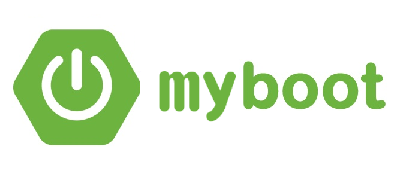

## 简介
myboot是一个基于springboot的项目脚手架。

## 技术栈

- Spring Boot 相关基础：

| 技术                 | 说明                | 官网                                                         |
| -------------------- | ------------------- | ------------------------------------------------------------ |
| SpringBoot           | 容器+MVC框架        | https://spring.io/projects/spring-boot                       |
| Spring Data JPA      | ORM框架             | https://spring.io/projects/spring-data-jpa                   |
| Hibernator-Validator | 验证框架            | http://hibernate.org/validator                               |
| Spring Security      | 安全框架            | https://spring.io/projects/                                  |
| JWT                  | Tokens方案          | https://jwt.io/                                              |
| QueryDSL             | 结构化查询工具      | http://www.querydsl.com/                                     |
| HikariCP             | 号称最快的连接池    | https://github.com/brettwooldridge/HikariCP                  |
| p6spy                | sql监控             | https://github.com/p6spy/p6spy                               |
| Lombok               | 简化对象封装工具    | https://github.com/rzwitserloot/lombok                       |
| Swagger-UI           | API文档工具         | https://github.com/swagger-api/swagger-ui                    |
| RabbitMq/Kafka       | 消息队列（待选型）  | https://www.rabbitmq.com/                                    |
| Redis                | 分布式缓存          | https://redis.io/                                            |
| MinIO                | 对象存储            | https://github.com/minio/minio https://hub.docker.com/r/minio/minio/ |
| Spring Boot Admin    | springboot 服务监控 | https://spring.io/projects/                                  |
| flyway               | 数据库脚本管理      | https://flywaydb.org/                                        |
| apt-maven-plugin     | querydsl Maven插件  | https://github.com/querydsl/apt-maven-plugin                 |
| Docker               | 应用容器引擎        | [https://www.docker.com](https://www.docker.com/)            |
| Jenkins              | 自动化部署工具      | https://github.com/jenkinsci/jenkins                         |

***

- **Spring Cloud**

  

  - Eureka 服务发现框架
  - Ribbon 进程内负载均衡器
  - Open Feign 服务调用映射
  - Hystrix 服务降级熔断器
  - Zuul 微服务网关
  - Config 微服务统一配置中心
  - Bus 消息总线
  - Nacos（Spring Cloud Alibaba）
    - Nacos = Spring Cloud Eureka + Spring Cloud Config
    - Nacos 可以与 Spring, Spring Boot, Spring Cloud 集成，并能代替  Eureka, Config。
    - 通过 Nacos Server 和 spring-cloud-starter-alibaba-nacos-config 实现配置的动态变更。
    - 通过 Nacos Server 和 spring-cloud-starter-alibaba-nacos-discovery 实现服务的注册与发现

- 其它技术栈首选Spring 内成熟的技术

主要功能：

- 结构化查询：Spring JPA + QueryDSL ，提供基础单表查询，复杂查询DSL封装

- 多数据源自动配置

- p6spy 自动配置

- p6spy 监控sql，自定义日志

- redis + aop 实现限流

- 全局的参数校验处理

- 全局异常处理

- 接口统一格式返回

- 分页封装

- minio 对象存储封装

- flyway 数据库脚本管理

- IDEA + groovy 自动代码生成

- Swagger 生成API 文档

- MDC 实现日志追踪 traceId （RPC、Http、异步线程**待处理**）

- Spring Security + JWT 实现认证和授权、单点登录

  

## 项目结构

~~~
 .
├── LICENSE					license 文件
├── README.md					README
├── myboot-demo	         			后台系统demo
├── myboot-commonbiz				通用业务模块
├── myboot-component			        组件模块
└── myboot-core					核心模块
~~~

## 使用

* git clone 
* mvn compile

## 计划

TODO:
1. 引入Spring Coud
2. 消息队列选型
3. 前端技术选型 Vue/React
4. 分库分表选型

## Feedback

 [gshiwen@gmail.com](mailto:gshiwen@gmail.com)

## License

[Apache License 2.0](LICENSE)

