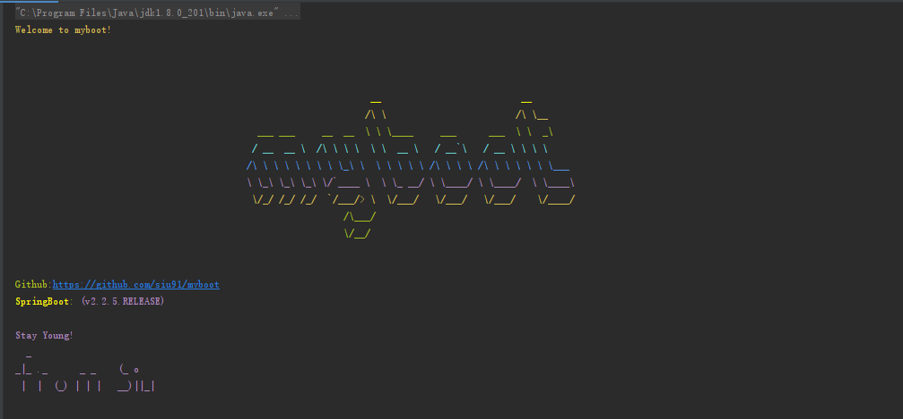
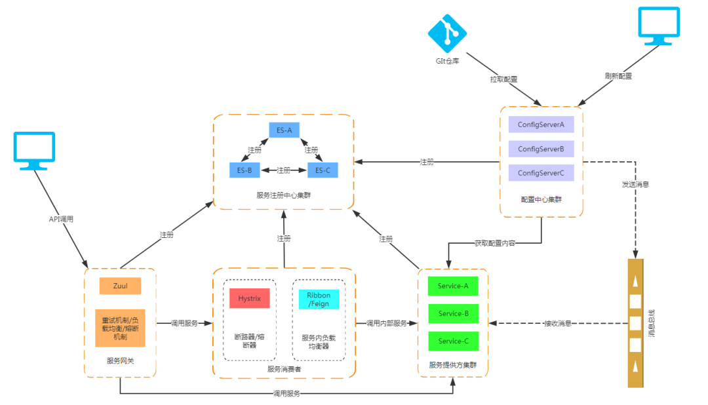
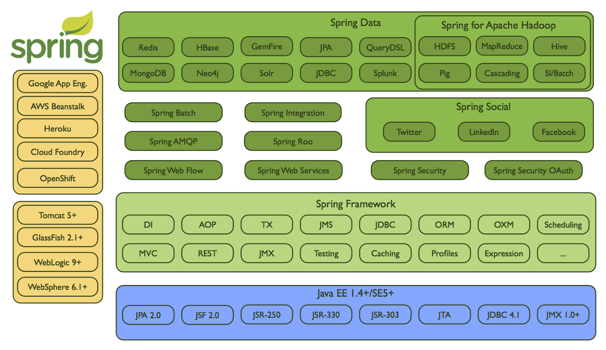

# myboot 

> myboot是一个基于Spring Boot/Spring Cloud的项目脚手架+Demo

## Features

- [结构化查询：Spring JPA + QueryDSL ，提供基础单表查询，复杂查询DSL封装](./myboot-framework/myboot-core/myboot-core-data/myboot-core-data-jpabp/src/main/java/org/siu/myboot/core/data)

  - BaseJpaRepository 封装了基础的分页查询
  - BaseJpaRepository 封装可快速实现复杂多表查询

- [p6spy 自动配置&p6spy 监控sql，自定义日志](./myboot-framework/myboot-core/myboot-core-data/myboot-core-data-jpabp/src/main/java/org/siu/myboot/autoconfigure/p6spy/)

  - 定义监控日志的输出 P6SpyMessageFormat

- [redis + aop 实现限流](./myboot-framework/myboot-core/myboot-core-config/src/main/java/org/siu/myboot/core/config/web/limiting/LimitingAspect.java)

  - 使用lua获取实时的流量（TODO优化支持redis cluster lua）
  - aop 获取注解流量配置和流量策略

- [全局的参数校验处理&全局异常处理](./myboot-framework/myboot-core/myboot-core-config/src/main/java/org/siu/myboot/core/config/web/handlers/GlobalExceptionHandler.java)

- [接口统一格式返回](./myboot-framework/myboot-core/myboot-core-base/src/main/java/org/siu/myboot/core/entity/vo/Result.java)

- [分页封装](./myboot-framework/myboot-core/myboot-core-base/src/main/java/org/siu/myboot/core/entity/qo)

- [minio OSS autoconfig&API封装](./myboot-framework/myboot-component/myboot-component-oss/src/main/java/org/siu/myboot)

- [IDEA + groovy 自动代码生成](./autogenerate/Generate%20JPA%20POJOs-REPOs-SERVICEs.groovy)

  - 支持jpa+QueryDSL
  - todo 支持 mybatis/mybatis-plus

- MDC 实现日志追踪 traceId （RPC、Http、异步线程**待处理**）

- [Spring Security + JWT 实现认证和授权、单点登录](./myboot-framework/myboot-core/myboot-core-auth/src/main/java/org/siu/myboot/auth)

  - 认证（Authentication）基于JWT（Spring Security UserSever 登录换取token）
  - 鉴权（Authorization）
    - 设计采用RBAC
      -  a. 规定角色可以对哪些资源进行哪些操作 
      - b. 规定主体拥有哪些角色当一个操作，同时满足a与b时，允许操作
    - [Spring Security @PreAuthorize("@pms.hasPermit('USER')") + 自定义PermitService](./myboot-framework/myboot-core/myboot-core-auth/src/main/java/org/siu/myboot/auth/util/PermitService.java)
  - 注销/黑名单等实现方式，暂时没有想到好的方式，目前用redis 保存token的版本来注销，**token有状态**

- [动态数据源](./myboot-framework/myboot-core/myboot-core-data/src/main/java/org/siu/myboot/core/data/dds)

  - [基于Spring AbstractRoutingDataSource + ThreadLocal 持有当前数据源](./myboot-framework/myboot-core/myboot-core-data/src/main/java/org/siu/myboot/core/data/dds/DynamicDataSource.java)
  - [Mybatis Interceptor拦截器自动设置数据源（可实现如：应用层读写分离）](./myboot-framework/myboot-core/myboot-core-data/src/main/java/org/siu/myboot/core/data/dds/mybatis/DynamicDataSourcePlugin.java)
  - [使用@DataSource(id = DataSourceId.PRIMARY) 手动设置数据源](./myboot-framework/myboot-core/myboot-core-data/src/main/java/org/siu/myboot/core/data/dds/aop/DataSource.java)
  - 未优化配置模块，支持一主一从或两个数据源
  - **TODO 支持**：
    - 多主多从 、多库（>2)
    - @DataSource 在类上使用
  
- 持久层配置：spring.datasource.persistence，可切换jpa/mybatis/mybatis-plus，默认jpa

- 自定义CustomConditionalOnProperty 实现 ConditionalOnProperty支持多个 havingValue

- 工具：

  - [Swagger 集成](./myboot-framework/myboot-component/myboot-component-swagger)
  - [Spring Boot Admin 集成](./myboot-framework/myboot-component/myboot-component-sbaserver)
  - DockerFile + Dcoker server发布应用

- 微服务：

  - Nacos 服务注册发现/配置中心（**TODO Nacos Server 高可用**）

  - 集成Ribbon，远程服务调用

  - 集成Sentinel，服务熔断&降级（使用nacos持久化配置）

  - Zipkin + Sentinel 分布式调用链路追踪（**TODO保存调用日志到ES/其它** ）

- 彩蛋，启动banner：

  
  

## 技术栈

- **Spring Boot** 相关：

| 技术                 | 说明                | 官网                                                         |
| -------------------- | ------------------- | ------------------------------------------------------------ |
| SpringBoot           | 容器+MVC框架        | https://spring.io/projects/spring-boot                       |
| Spring Data JPA      | ORM框架             | https://spring.io/projects/spring-data-jpa                   |
| mybatis-plus         | ORM框架工具         | https://mp.baomidou.com/                                     |
| Hibernator-Validator | 验证框架            | http://hibernate.org/validator                               |
| Spring Security      | 安全框架            | https://spring.io/projects/                                  |
| JWT                  | Tokens方案          | https://jwt.io/                                              |
| QueryDSL             | 结构化查询工具      | http://www.querydsl.com/                                     |
| HikariCP             | 号称最快的连接池    | https://github.com/brettwooldridge/HikariCP                  |
| p6spy                | sql监控             | https://github.com/p6spy/p6spy                               |
| Lombok               | 简化对象封装工具    | https://github.com/rzwitserloot/lombok                       |
| Swagger-UI           | API文档工具         | https://github.com/swagger-api/swagger-ui                    |
| RabbitMq/Kafka       | 消息队列（待选型）  | https://www.rabbitmq.com/                                    |
| Redis                | 分布式缓存          | https://redis.io/                                            |
| MinIO                | 对象存储            | https://github.com/minio/minio https://hub.docker.com/r/minio/minio/ |
| Spring Boot Admin    | springboot 服务监控 | https://spring.io/projects/                                  |
| flyway               | 数据库脚本管理      | https://flywaydb.org/                                        |
| apt-maven-plugin     | querydsl Maven插件  | https://github.com/querydsl/apt-maven-plugin                 |
| Docker               | 应用容器引擎        | [https://www.docker.com](https://www.docker.com/)            |
| Jenkins              | 自动化部署工具      | https://github.com/jenkinsci/jenkins                         |

***

- **Spring Cloud**

  

  - ~~Eureka 服务注册&发现框架~~ （使用Nacos代替）

  - Ribbon 进程内负载均衡器

  - Open Feign 服务调用映射

  - ~~Hystrix 服务降级熔断器~~（使用Sentinel代替）

  - Zuul 微服务网关

  - Config 微服务统一配置中心 （使用Nacos代替）

  - ~~Bus 消息总线~~

  - zipkin 调用链追踪

  - **集成Spring Cloud Alibaba 补充相关功能:**
    - 服务限流降级：使用 Sentinel 进行流量控制，熔断降级以及系统保护等多个维度保护服务稳定性（**完成**）
    
    - 服务注册与发现：使用 Nacos 适配 Spring Cloud 服务注册与发现标准，默认集成了 Ribbon 这个客户端负载均衡组件（**完成**）
      
      - 通过 Nacos Server 和 spring-cloud-starter-alibaba-nacos-discovery 实现服务的注册与发现
      
    - 分布式配置管理：以 Nacos 作为数据存储支持分布式系统中的外部化配置，配置更改时自动刷新（**完成**）
      
      - 通过 Nacos Server 和 spring-cloud-starter-alibaba-nacos-config 实现配置的动态变更。
      
    - 事件驱动：使用 Spring Cloud Stream RocketMQ Binder 来构建事件驱动的微服务实例（**进行中**）
    
    - 消息总线：使用 Spring Cloud Bus RocketMQ 连接分布式系统中的各个节点（**进行中**）
    
    - 分布式事务：使用 Seata 高效并且对业务零侵入地解决分布式事务问题（**进行中**）
    
    - Dubbo RPC：扩展 Spring Cloud 服务调用协议，可使用 Spring Cloud 客户端调用 Dubbo 服务（未计划集成）
    
    - 阿里云 OSS 集成: 使用阿里云 OSS 服务集成 Spring Resource 资源（未计划集成）
    
      

- **其它**（首选Spring 内成熟的技术）

​    

## 项目结构

~~~
 .
├── LICENSE	license 文件
├── README.md README
├── autogenerate 代码生成	         		
├── myboot-demo-ganxu demo		
└── myboot-framework 框架
~~~

## 使用

* git clone 
* mvn compile

## 计划

TODO:
1. 引入Spring Coud
2. 集成 Spring Coud Alibaba
3. features 放到 CHANGELOG
4. 分布式事务集成
5. 消息队列选型
6. 前端技术选型 Vue/React
7. 分库分表选型

## Feedback

 [gshiwen@gmail.com](mailto:gshiwen@gmail.com)

## License

[Apache License 2.0](LICENSE)

